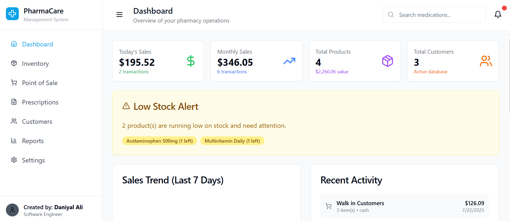
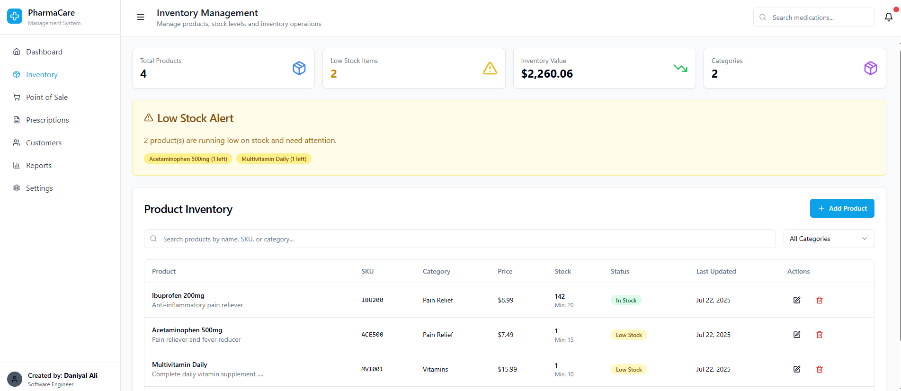
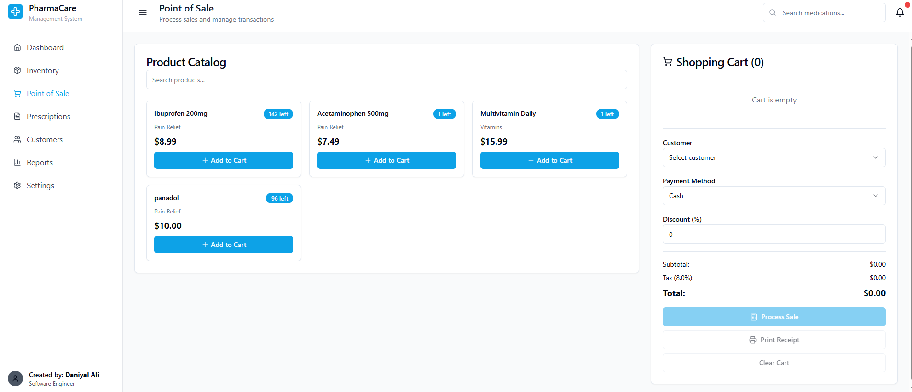
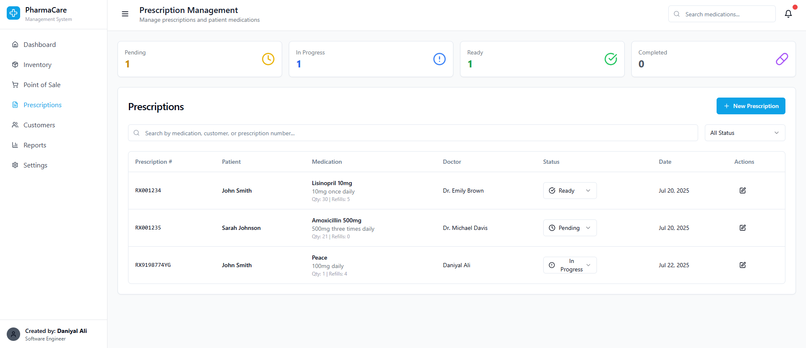
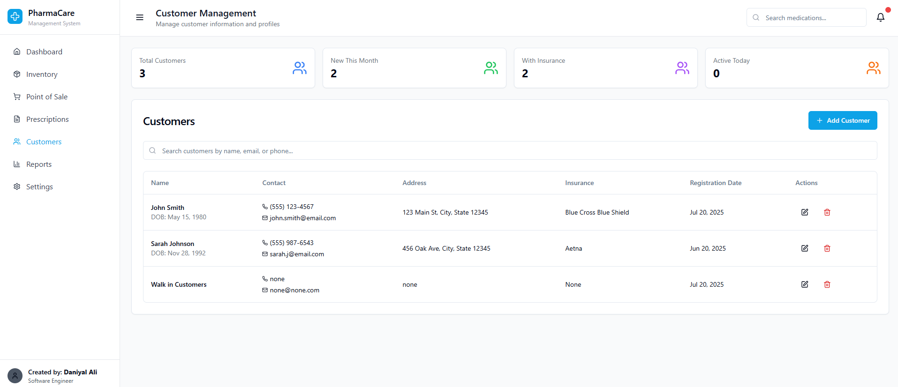
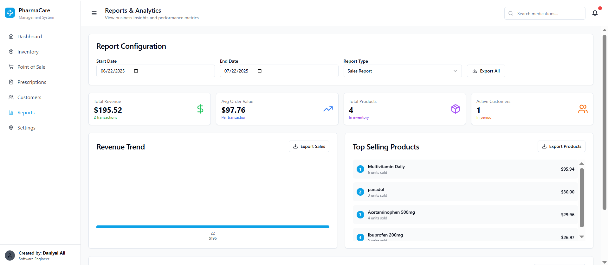
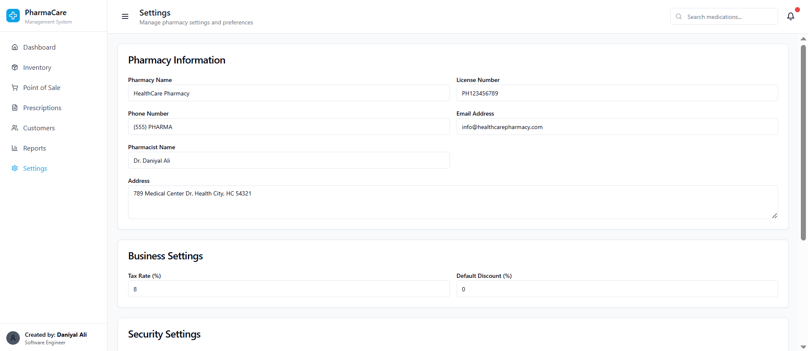

# PharmaCare - Pharmacy Management System

PharmaCare is a fully functional, responsive **frontend pharmacy store system** built using **React**, **TypeScript**, and **LocalStorage**. It allows pharmacy owners to manage inventory, customers, prescriptions, point-of-sale operations, reports, and system settings — all without requiring a backend.




---

## 🔧 Tech Stack

- ⚛️ React (Functional Components + Hooks)
- 🟦 TypeScript (Type-safe, scalable architecture)
- 💾 Browser LocalStorage (Data persistence without database)
- 🧩 CSS/Utility Frameworks (Tailwind CSS / Bootstrap or custom)

---

## 🚀 Features

### 🧭 Dashboard
- Today's and Monthly Sales
- Total Products, Inventory Value, and Total Customers
- Low Stock Alerts
- Sales Trend Chart (Last 7 Days)
- Quick Actions (Create Sale, Add Prescription/Product)

### 📦 Inventory
- Full product listing (search by name, SKU, or category)
- Add/Edit/Delete Product
- Low stock warning system
- Product details: name, SKU, type, manufacturer, expiry, stock levels
- PIN-based security for edits/deletion

### 💳 Point of Sale (POS)
- Add items to cart from inventory
- Customer selection dropdown
- Payment method + discount input
- Cart total, process sale, print receipt, and clear cart

### 📑 Prescriptions
- Filter by status: Pending, In Progress, Ready, Completed
- Add prescription with customer + medicine details
- Search prescriptions by name, medication, or ID

### 👥 Customers
- Add/Edit/Delete customers with full detail
- Filter by active today / with insurance / this month
- Display name, email, address, insurance, and reg. date

### 📊 Reports
- Revenue chart and analytics
- Top products and top customers
- Export buttons for reports and sales

### ⚙️ Settings
- Pharmacy info: license, phone, pharmacist, etc.
- Tax and discount configuration
- PIN update (for secure actions)
- Export/Import data options
- Clear all data button

---

## 📸 Screenshots

### Dashboard


### Inventory


### Point of Sale


### Prescription


### Customers


### Reports


### Settings


---
### 💾 Data Persistence

- All data (products, sales, customers, settings) is stored in localStorage. 
- No backend or database setup required.

---

### 🔐 Security
- Deleting or editing products and customers requires a 4-digit PIN

- PIN can be configured in Settings > Security

---

### 🧩 Customization
Want to plug in Firebase, Supabase, MongoDB, or Express backend? The architecture is ready for backend migration.

---

### 📜 License
 ```
 This project is licensed for personal or commercial pharmacy use,
 Attribution appreciated.

 ```

---

## 📁 Installation

```bash
git clone https://github.com/daniyalalii/PharmaCare.git
npm install
npm run dev
go to your local browser and type localhost:5000

```

---

# 🙋‍♂️ Author

Daniyal Ali – React Developer

📧 daniyaljatt275@gmail.com

🌐 Portfolio : https://daniyal-ali-portfolio.netlify.app/

 Made with ❤️ for efficient, modern pharmacy operations.


